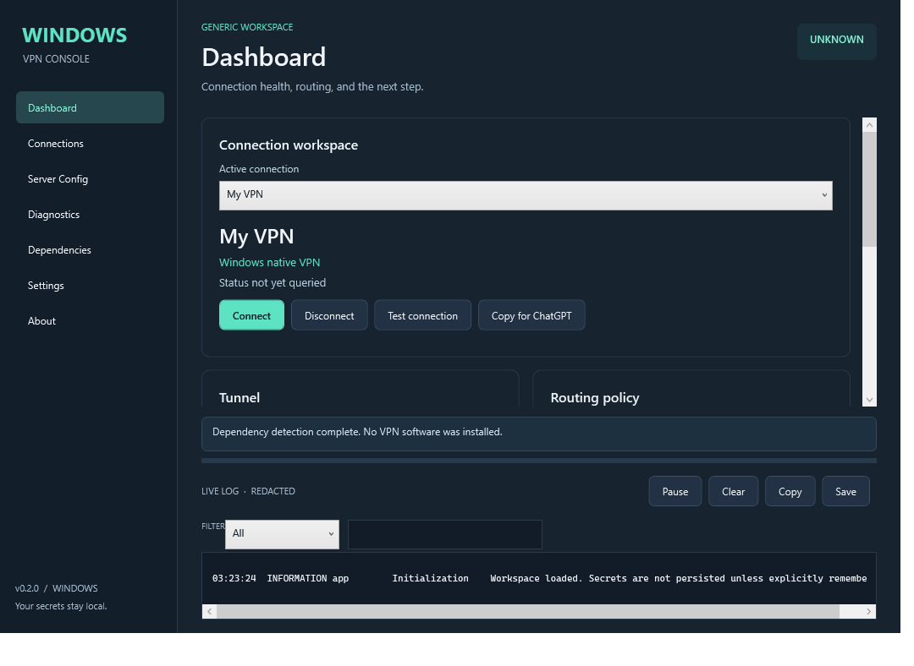

# CNIT 455 VPN Console

A portable Windows 11 x64 network administration utility for seven CNIT 45500 Lab 2 VPN scenarios and reusable VPN profiles. Built with C#, WPF, MVVM and .NET 10. It controls established VPN engines; it does not implement VPN cryptography.

**Version 0.1.1** addresses unreadable dropdown selections in the dark interface. Release-specific validation is recorded in [PROJECT_STATUS.md](PROJECT_STATUS.md).

The preceding **v0.1.0** [Windows validation](https://github.com/esixtosr/CNIT455-VPN-Console/actions/runs/37385355364) passed **122 tests**, native L2TP profile/route provisioning and removal, Credential Manager storage, and **33 WPF runtime assertions** on both the normal build and extracted self-contained ZIP. External VPN engines were absent on the runner; their live launches, handshakes and real lab traffic remain unverified. See [acceptance details](docs/Acceptance.md).



The screenshot uses the Mock provider; it is not a real VPN connection.

## Quick start

1. On Windows 11 x64, sign in to GitHub using an account with access to this private repository and open [Releases](https://github.com/esixtosr/CNIT455-VPN-Console/releases).
2. Open the latest published release and expand **Assets**. Download `CNIT455-VPN-Console-v0.1.1-win-x64.zip` (or the matching ZIP for that release) and `SHA256SUMS.txt`. **Code > Download ZIP** and the **Source code** assets contain source files, not the runnable application.
3. Optionally compare `Get-FileHash .\CNIT455-VPN-Console-v0.1.1-win-x64.zip -Algorithm SHA256` with the matching entry in `SHA256SUMS.txt`.
4. Right-click the ZIP, choose **Extract All**, then open the extracted folder and run **CNIT455-VPN.exe**. This is a portable application with no installer. No Visual Studio, SDK, or separately installed .NET runtime is needed.
5. Select Lab Mode, set the group number, confirm addresses, then choose a connection. Dependencies shows the required external engine.
6. Start with Local Test authentication, collect diagnostics, then move server authentication to AD/RADIUS/LDAP. Use Check-Off to record evidence.

The executable is not code signed. Windows may show an unknown-publisher prompt. Confirm the repository and checksum before running. Do not disable Windows security protections.

## Why GitHub and how updates work

GitHub stores the source code and its change history, runs the Windows build and test workflow, and distributes versioned downloads through Releases. The downloaded application runs locally on your Windows computer; GitHub does not host your VPN or monitor your connections. You do not need Git installed, and the app does not need a GitHub login to run. Signing in is necessary to download from this private repository.

There is no automatic updater. To update, disconnect the active VPN, close the console, download the new release ZIP, and extract it to a separate folder. Run the new folder's `CNIT455-VPN.exe`; keep the old folder until you have checked the update.

Saved profiles and settings remain in `%LOCALAPPDATA%\CNIT455-VPN-Console` for the same Windows user, outside the application folder. Imported OpenVPN, WireGuard, and other external configuration files are linked by their original paths, so keep those files in place. If you stored an imported configuration inside the old application folder, move it to a secure permanent location and update the profile's configuration path before deleting that folder.

## Connections and dependencies

| Provider | Protocols | Integration and limits |
|---|---|---|
| Windows native | L2TP/IPsec, IKEv2, SSTP | Windows PowerShell VPN cmdlets and RAS APIs; only app-owned profiles are altered. No PPTP. |
| OpenVPN Community | OpenVPN | Separately installed `openvpn.exe`; imported self-contained configs with a restricted directive set, owned process and local management channel. |
| WireGuard for Windows | WireGuard | Separately installed `wireguard.exe`/`wg.exe`; tunnel services require administrator rights. |
| Shrew Soft | Legacy mobile IPsec | Imported/named profiles and interactive launch. Its old releases have no verified Windows 11 support; status may remain UNKNOWN. No invented profile PSK encoding. |
| NCP Secure Entry | External IPsec | Optional detection and manual-client handoff; no redistributable engine or unverified automation commands. |
| Mock | Simulated stages and failures | Developer Mode only. Simulations are visibly labeled and are not lab evidence. |

The app detects paths, versions, privilege and engine limitations. It does not silently install VPN software. Official download links are provided. See [provider research](docs/Providers-Research.md) for the exact reviewed interfaces.

## Lab Mode and Generic Mode

The built-in **CNIT 455 - Lab 2** topology derives public and VyOS DMZ addresses from a group number (default 33). All topology fields are editable. pfSense Remote is **192.168.4.0/24**; `192.168.5.0/24` produces a reserved-range warning. Confirm the different original/new router endpoints: the course specification uses the same VyOS external address for different scenarios.

IPsec Mobile has Strict (VyOS Remote only), Extended (Remote plus HQ through WireGuard), and Custom route policies. The interface explains the conflicting course wording. Generic Mode removes the lab assumptions and enables arbitrary native IKEv2/SSTP, L2TP, OpenVPN, WireGuard and external IPsec profiles.

Three site-to-site helpers provide reviewed configuration templates/checklists, NAT exclusions, capture guidance and manual checkoff evidence. The app never applies router/firewall configuration automatically. Unsupported VyOS versions and legacy XAUTH templates fail closed with an explanation.

## Diagnostics and Copy for ChatGPT

Collects relevant adapters, IP/DNS/gateway details, IPv4 routes, provider status, recent RAS events and normalized logs. Routing validation uses longest-prefix matching and route + interface metrics. An unidentifiable tunnel, ICMP timeout, ambiguous equal-cost route or absent protocol observation remains **UNKNOWN**. IPv6 and actual destination reachability require separate inspection.

**COPY FOR CHATGPT** creates sanitized plain text. Pasted server output remains in the session unless you explicitly export evidence. Checkoff ZIPs contain a summary, diagnostics, routes, interfaces, status, redacted logs, checkoff JSON and versions. Manual results are identified as user attestations. Captures are not automatically included.

## Security and privacy

No telemetry, analytics or cloud account is required. Profiles are JSON without password, PSK or private-key fields. Secrets are not remembered by default; optional storage uses Windows Credential Manager for the current user. Provider-managed tunnel state can require protected system storage; see [Security](docs/Security.md). Passwords are not supplied as command-line arguments. Imported provider configurations may already contain secrets: keep originals secure.

Logs are sanitized before display, persistence, clipboard and export. PEM/inline credentials, sensitive labels, registered secrets and key-shaped strings are removed conservatively. Review exported diagnostics before sharing; IP addresses, hostnames and certificate metadata can remain visible. Logs live in `%LOCALAPPDATA%\CNIT455-VPN-Console\Logs` with 14-day default retention. Profiles and settings reside alongside Logs.

The app starts without requiring elevation. Some provider actions require administrator rights and report that requirement. It never disables Windows Firewall, weakens global IPsec policy, installs drivers silently or modifies unrelated adapters.

## Build and test

Requires .NET 10 SDK. A Windows machine is required to run WPF and provider integration.

```powershell
dotnet restore CNIT455-VPN-Console.sln
dotnet build CNIT455-VPN-Console.sln -c Release --no-restore
dotnet test tests/CNIT455.VPN.Tests -c Release --no-build
powershell -File scripts/Publish.ps1 -Version v0.1.1
```

Core, generators, diagnostics and managed unit tests can also be built on macOS/Linux. Cross-compiling WPF uses `EnableWindowsTargeting`; a successful cross-build is not proof of Windows runtime behavior.

## Release process

GitHub Actions builds on Windows, runs unit tests and a WPF startup/navigation smoke test, publishes a self-contained win-x64 executable, packages docs/presets, calculates SHA-256 and uploads artifacts. Pushing `v*` creates a GitHub Release from the same verified package. Tags and versions must match. No external VPN engines or course PDFs are bundled. See [Architecture](docs/Architecture.md) and [CONTRIBUTING.md](CONTRIBUTING.md).

## Documentation

[Lab guide](docs/Lab2-Guide.md) · [Mobile IPsec](docs/IPsec-Mobile.md) · [L2TP](docs/L2TP.md) · [OpenVPN](docs/OpenVPN.md) · [WireGuard](docs/WireGuard.md) · [VyOS](docs/VyOS.md) · [pfSense](docs/pfSense.md) · [Diagnostics](docs/Diagnostics.md) · [Security](docs/Security.md)

## Disclaimer and license

CNIT455 VPN Console is an independent educational/network administration utility. It is not affiliated with Purdue University, VyOS, Netgate/pfSense, OpenVPN, WireGuard, NCP, or Shrew Soft. No Purdue logos or laboratory PDFs are included.

Original code is licensed under [MIT](LICENSE). See [THIRD_PARTY_NOTICES.md](THIRD_PARTY_NOTICES.md) for dependencies and upstream references.
